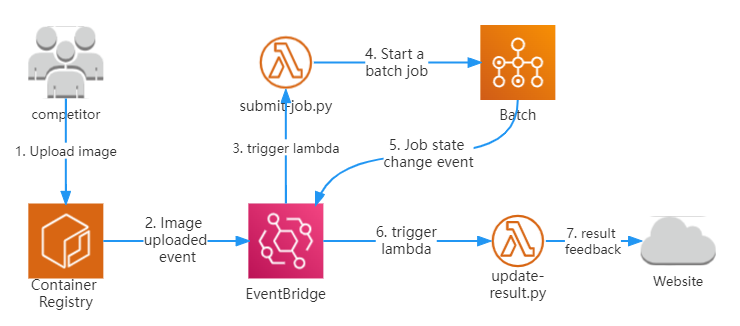

# Carsmos Online Simulation & Scoring System

## About
This project is the online portion of the carsmos competition.

The architecture of the system and all the code are given here.

- Competition homepage: [Carsmos Competition 2023](https://www.carsmos.ai/Race2023/)
- Competition docs: [Carsmos Competition Docs](https://docs.carsmos.cn/#/)

## Getting Started
The following will explain how the online system works in detail.

### 1. Submitting algorithm
The command to submit the algorithm can be obtained on the [algorithm submission platform](https://race.carsmos.cn/). 
And this command just uses the [upload.sh](scripts/upload.sh) script.

### 2. Starting a batch job
After successfully uploading the image, ECR will send an event message to Event Bridge, 
and Lambda will listen to this event, thus starting the script [submit-job.py](lambda/submit-job.py) to create a job.

### 3. Starting simulation
After the task is successfully created, 
the background machine will start running and pull the image uploaded by the contestant. 
After the pull is complete, the script [start_evaluation.sh](scripts/start_evaluation_old.sh) will be executed. 
This script will execute [run_evaluation.sh](scripts/run_evaluation.sh) to execute the algorithm in the user image.
During and after the execution of the algorithm, [s3upload.sh](scripts/s3upload.sh) will be used to upload some key data to S3.

During a simulation run, the state of a task changes. 
The state change will be sent to EventBridge as an event, 
and the lambda function of [update-result.py](lambda/update-result.py) will listen to these events and make different reactions according to different states.

### 4. Result feedback
After the simulation run, the machine will be automatically shut down. 
Next, the lambda function of [update-result.py](lambda/update-result.py) will be called to feed back the simulation results to the algorithm submission platform. 
Participants will then be able to see the results and performance of the submission.